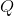
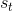
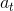
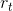
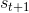
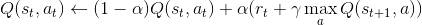
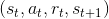
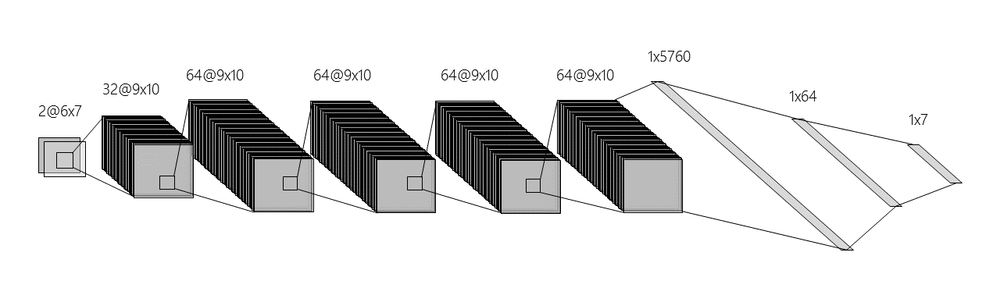
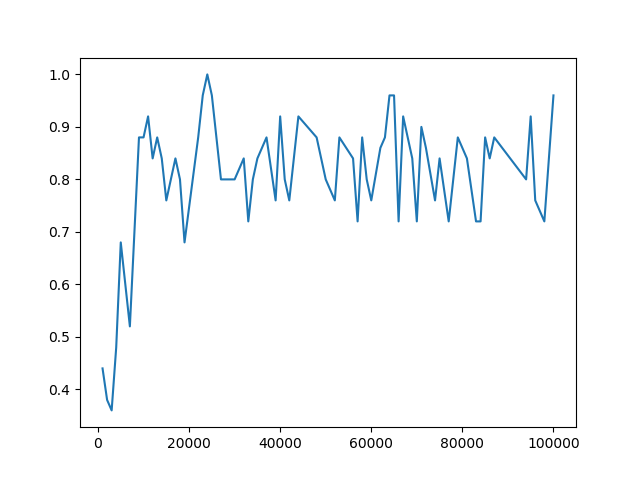

# ConnectFour-RL
KAIST 2019 Fall Semester - CS470: Introduction to Artificial Intelligence - Term Project

20150184 Eunseob Kim, 20160580 Sanghyun Jung

---------------------
**Reinforcement learning** is one area of machine learning. In given environment, an agent takes action which produces new environment with some rewards, and the agent learns from repeating those process, trying to maximise rewards. The first novel paper applying reinforcement learning technique to a game is 'Playing Atari with Deep Reinforcement Learning' from DeepMind Technologies. They suggested **deep Q-learning** with experience replay, which is also be used in our final project, for agent to be trained selecting proper action in an environment more stably.

We applied such a technique to another game, **Connect Four**. 'Connect Four' is a twoplayer connection game, similar to gomoku or omok in Korean, but three main differences exist. First, the objective of the game is not to form a line of five same stones, but form a line of FOUR same stones; the reason of sometimes being called samok in Korean. Second, the board size is very limited compared to gomoku, only having seven columns and six rows. Third, the board is vertically suspended, so that the stones fall straight down occupying the lowest available space within the column.

 

## Deep Q-Learning
We trained an agent with deep Q-learning with experience replay, suggested in the paper of DeepMind. Q-learning is called a "model-free reinforcement learning algorithm" which is because it does not require a model of the environment. Q table, denoted , is first initialized with random value. At each time , where the current state is , the agent selects action , gets a reward , and changes state to . Then,  is updated by following algorithm, where  is learning rate, and  is discount factor.



This method seems to work, however, when a nonlinear function approximator such as a neural network is used to represent , policy fluctuates rapidly which makes learning unstable or divergence because of correlation in the observation sequence. To solve this problem,  experience replay technique is used, putting sequence  to a buffer and picking random sequences after with the number of batch size to remove correlation. You can check more details in the paper of DeepMind Technologies.

## Dependency

* Python 3.7
* ``` pip install pytorch ```
* ``` pip install numpy ```
* ``` pip install matplotlib ```
* ``` pip install tqdm ```

## Code Structure

- ```agents/dqn_agent/dqn_model.py```  Covolutional Neural Network structure of DQN

- ```agents/dqn_agent/dqn_agent.py```  select action using DQN model and training algorithm
- ```agents/dqn_agent/models/model1_100000.pt```  pre-trained pytorch model for DQN - player 1
- ```agents/dqn_agent/models/model2_100000.pt```  pre-trained pytorch model for DQN - player 2
- ```utils/utils.py```  convert game state to (1, 2, 6, 7) sized pytorch tensor

- ```train.py```  play games and save game states and actions to replay memory and optimize DQN
- ```play.py```  play game with pre-trained models

## Run

* Train

  Train dqn agent versus random agent

  ``` 
  python train.py -1p "dqn_train" -2p "random"
  ```

  - ```-1p```  choose agent1 ("random", "dqn_train", "dqn_eval")
  - ```-1m```  filename of model of agent1
  - ```-2p```  choose agent2 ("random", "dqn_train", "dqn_eval")
  - ```-2m``` filename of model of agent2
  - ```-e```  max number of episodes iteration (default: 100000)
  - ```--train```  train agent frequency (episodes per 1 train) (default: 5)
  - ```--target```  target update frequency (episodes per 1 target update) (default: 50)
  - ```--save```  model save frequency (episodes per 1 model save) (default: 1000)

* Play

  Play game with pre-trained model
  
  ```
  python play.py -1p "dqn" -2p "human" -r -v
  ```
  
  - ```-1p```  choose agent1 ("random", "dqn", "human")
  - ```-1m```  filename of model of agent1 (default: "model1_100000.pt")
  - ```-2p```  choose agent2 ("random", "dqn", "human")
  - ```-2m```  filename of model of agent1 (default: "model2_100000.pt")
  - ```-e```  max number of episodes iteration (default: 10)
  - ```-r```  render the game state with GUI
  - ```-v```  verbose the game winner for each game
  - ```-d```  delay between actions (seconds) (default: 0.5)

## Result

|  |
|:---:|
| DQN agent trained with Random Agent |

After 100,000 episiodes, DQN agent wins 96% of 1,000 games against random agent.

100,000 model DQN agent vs. Beginner-level Human players:

| vs. Human players | DQN agent win rate |
|:---:| :---:|
| vs. Human 1 (Mr. Lee)  | 0.4  |
| vs. Human 2 (Mr. Kim)  | 0.3  |
| vs. Human 3 (Ms. Lee)  | 0.4  |
| vs. Human 4 (Mr. Park) | 0.2  |
| vs. Human 5 (Mr. Kim)  | 0.3  |
| **Average**            | **0.32** |


## References
- ["Playing Atari with Deep Reinforcement Learning"](https://arxiv.org/abs/1312.5602)