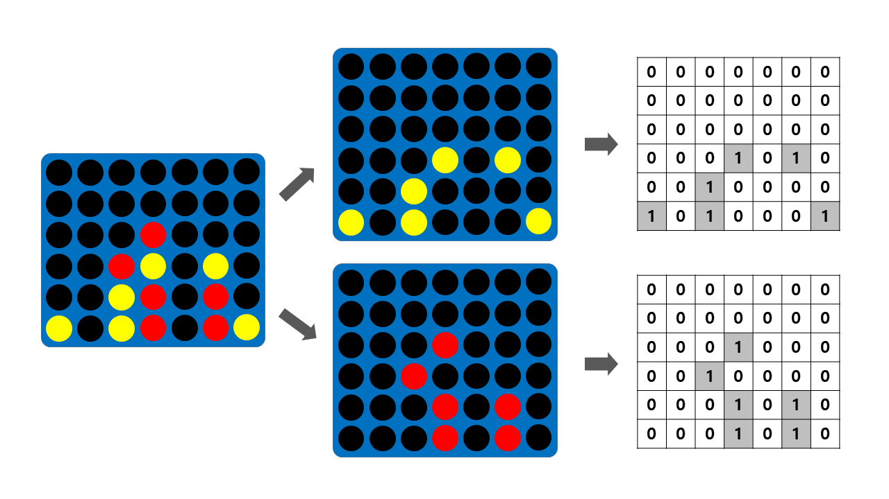

# ConnectFour-RL
20150184 Eunseob Kim, 20160580 Sanghyun Jung

---------------------

Connect Four is a twoplayer connection game, similar to gomoku or omok in Korean, but three main differences exist. First, the objective of the game is not to form a line of five same stones, but form a line of FOUR same stones; the reason of sometimes being called samok in Korean. Second, the board size is very limited compared to gomoku, only having seven columns and six rows. Third, the board is vertically suspended, so that the stones fall straight down occupying the lowest available space within the column.

 


## Dependency

* Python 3.7
* ``` pip install pytorch ```
* ``` pip install numpy ```
* ``` pip install matplotlib ```
* ``` pip install tqdm ```

## Code Structure

- ```agents/dqn_agent/dqn_model.py```  Covolutional Neural Network structure of DQN

- ```agents/dqn_agent/dqn_agent.py```  select action using DQN model and training algorithm
- ```agents/dqn_agent/models/model1_100000.pt```  pre-trained pytorch model for DQN - player 1
- ```agents/dqn_agent/models/model2_100000.pt```  pre-trained pytorch model for DQN - player 2
- ```utils/utils.py```  convert game state to (1, 2, 6, 7) sized pytorch tensor

- ```train.py```  play games and save game states and actions to replay memory and optimize DQN
- ```play.py```  play game with pre-trained models

## Run

* Train

  Train dqn agent versus random agent

  ``` 
  python train.py -1p "dqn_train" -2p "random"
  ```

  - ```-1p```  choose agent1 ("random", "dqn_train", "dqn_eval")
  - ```-1m```  filename of model of agent1
  - ```-2p```  choose agent2 ("random", "dqn_train", "dqn_eval")
  - ```-2m``` filename of model of agent2
  - ```-e```  max number of episodes iteration (default: 100000)
  - ```--train```  train agent frequency (episodes per 1 train) (default: 5)
  - ```--target```  target update frequency (episodes per 1 target update) (default: 50)
  - ```--save```  model save frequency (episodes per 1 model save) (default: 1000)

* Play

  Play game with pre-trained model
  
  ```
  python play.py -1p "dqn" -2p "human" -r -v
  ```
  
  - ```-1p```  choose agent1 ("random", "dqn", "human")
  - ```-1m```  filename of model of agent1 (default: "model1_100000.pt")
  - ```-2p```  choose agent2 ("random", "dqn", "human")
  - ```-2m```  filename of model of agent1 (default: "model2_100000.pt")
  - ```-e```  max number of episodes iteration (default: 10)
  - ```-r```  render the game state with GUI
  - ```-v```  verbose the game winner for each game
  - ```-d```  delay between actions (seconds) (default: 0.5)

## Result

|  |
|:---:|
| DQN agent trained with Random Agent |

After 100000 episiodes, DQN agent wins 96% of 1000 games against random agent.

100000 model DQN agent vs. Beginner-level Human players:

| vs. Human players | DQN agent win rate |
|:---:| :---:|
| vs. Human 1 (Mr. Lee)  | 0.4  |
| vs. Human 2 (Mr. Kim)  | 0.3  |
| vs. Human 3 (Ms. Lee)  | 0.4  |
| vs. Human 4 (Mr. Park) | 0.2  |
| vs. Human 5 (Mr. Kim)  | 0.3  |
| **Average**            | **0.32** |


## References
- ["Playing Atari with Deep Reinforcement Learning"](https://arxiv.org/abs/1312.5602)